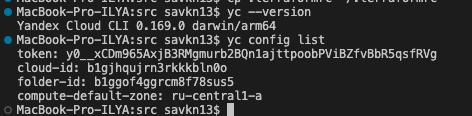
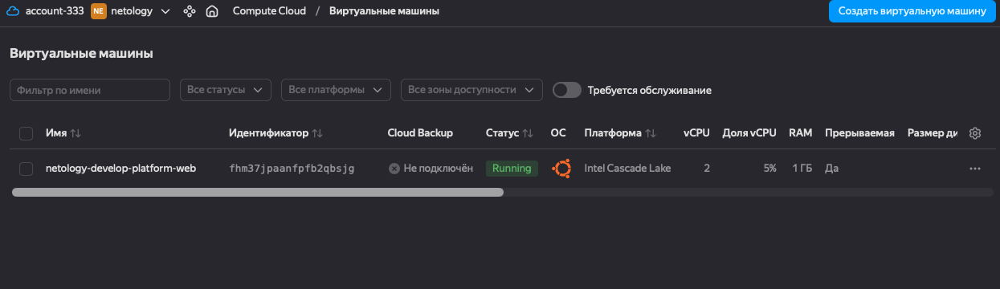
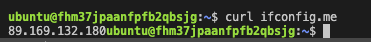
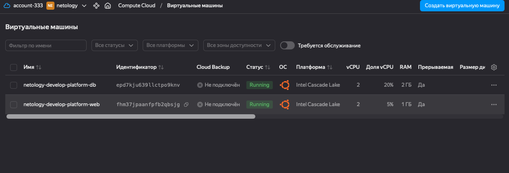
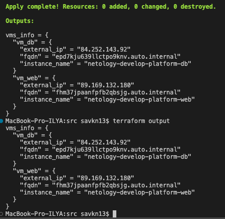

# Домашнее задание к занятию «Основы Terraform. Yandex Cloud»
 
## Чек-лист готовности
 
- Аккаунт Yandex Cloud зарегистрирован, промокод активирован
- Yandex CLI установлен и настроен
- Сервисный аккаунт `terraform-sa` создан, ключ сохранён в `~/.authorized_key.json`
 

 
---
 
## Задание 1
 
### 1.2 — Намеренные ошибки в main.tf и их исправление
 
После выполнения `terraform validate` были обнаружены следующие ошибки:
 
**Ошибка 1 — опечатка в названии платформы:**
```hcl
# было (неверно):
platform_id = "standart-v4"
 
# стало (исправлено):
platform_id = "standard-v2"
```
Допущены две ошибки сразу: опечатка `standart` вместо `standard`, и несуществующая платформа `v4` (доступны v1, v2, v3).
 
**Ошибка 2 — недопустимое количество ядер:**
```hcl
# было (неверно):
cores = 1
 
# стало (исправлено):
cores = 2
```
Для платформы `standard-v2` с `core_fraction=5` минимальное количество ядер — 2.
 
### 1.6 — Подключение к ВМ и проверка внешнего IP
 

 

 
Внешний IP-адрес ВМ: `89.169.132.180` — совпадает с выводом `curl ifconfig.me`.
 
### 1.8 — Параметры preemptible и core_fraction
 
**`preemptible = true`** — прерываемая ВМ. Яндекс может остановить её в любой момент (максимальное время жизни — 24 часа), но стоит значительно дешевле обычной. В процессе обучения это позволяет экономить деньги на грантах — ВМ нужна только пока выполняется задание, после чего её можно удалить через `terraform destroy`.
 
**`core_fraction = 5`** — гарантирует только 5% мощности CPU вместо 100%. ВМ работает, но с ограниченной производительностью. Стоит намного дешевле — для учебных задач, где не требуется высокая производительность, это оптимальный вариант.
 
---
 
## Задание 2 — Переменные с префиксом vm_web_
 
Все хардкод-значения вынесены в переменные в файле `variables.tf` с префиксом `vm_web_`:
 
```hcl
variable "vm_web_name" {
  type    = string
  default = "netology-develop-platform-web"
}
variable "vm_web_platform_id" {
  type    = string
  default = "standard-v2"
}
variable "vm_web_image_family" {
  type    = string
  default = "ubuntu-2004-lts"
}
variable "vm_web_cores" {
  type    = number
  default = 2
}
variable "vm_web_memory" {
  type    = number
  default = 1
}
variable "vm_web_core_fraction" {
  type    = number
  default = 5
}
```
 
Результат `terraform plan` — изменений нет:
```
No changes. Your infrastructure matches the configuration.
```
 
---
 
## Задание 3 — Вторая ВМ и файл vms_platform.tf
 
Создан файл `vms_platform.tf` с переменными обеих ВМ. Создана вторая ВМ `netology-develop-platform-db` в зоне `ru-central1-b`:
 
```hcl
resource "yandex_compute_instance" "platform_db" {
  name        = var.vm_db_name
  platform_id = var.vm_db_platform_id
  zone        = var.vm_db_zone
  resources {
    cores         = var.vm_db_cores
    memory        = var.vm_db_memory
    core_fraction = var.vm_db_core_fraction
  }
  ...
}
```
 

 
---
 
## Задание 4 — outputs.tf
 
Файл `outputs.tf`:
 
```hcl
output "vms_info" {
  value = {
    vm_web = {
      instance_name = yandex_compute_instance.platform.name
      external_ip   = yandex_compute_instance.platform.network_interface[0].nat_ip_address
      fqdn          = yandex_compute_instance.platform.fqdn
    }
    vm_db = {
      instance_name = yandex_compute_instance.platform_db.name
      external_ip   = yandex_compute_instance.platform_db.network_interface[0].nat_ip_address
      fqdn          = yandex_compute_instance.platform_db.fqdn
    }
  }
}
```
 
Вывод `terraform output`:
